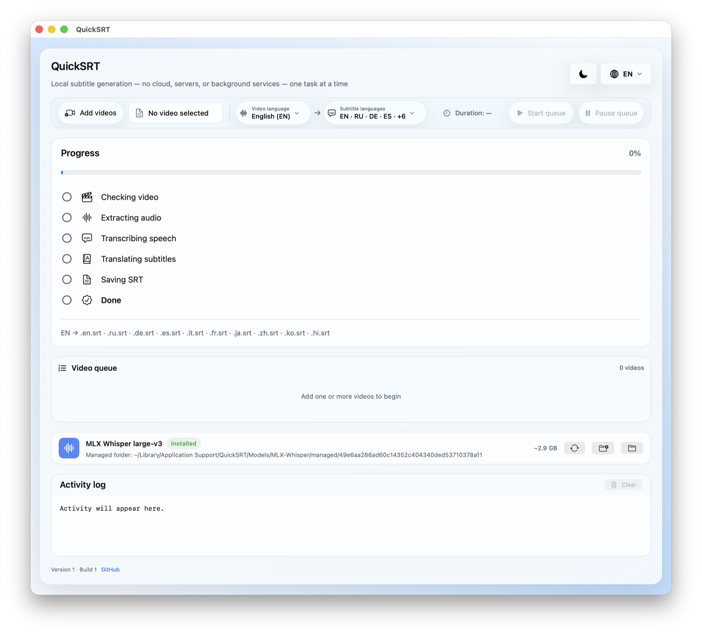
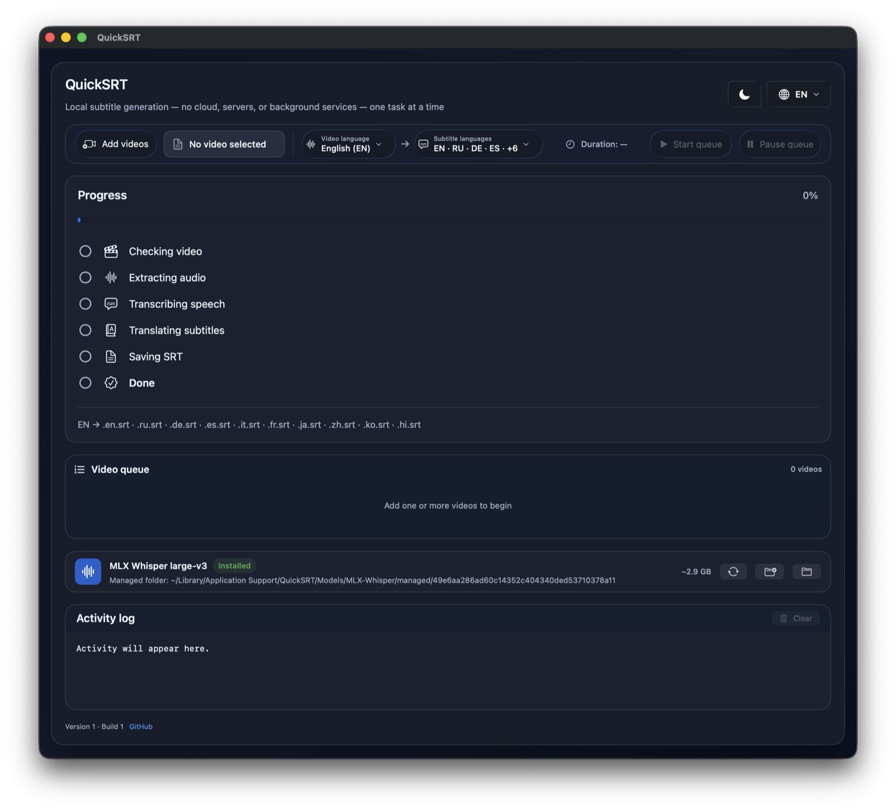

# QuickSRT

[](https://github.com/abgitdev/QuickSRT/actions/workflows/ci.yml)


[](LICENSE)


[](CONTRIBUTING.md)

QuickSRT is a local-first macOS application that turns one or more videos into clean, validated `.srt` subtitle files. It combines a native SwiftUI interface, FFmpeg media processing, MLX Whisper speech recognition, and Apple Translation while keeping video, extracted audio, transcripts, and generated subtitles on the Mac.

QuickSRT is designed for people who need practical subtitle generation without uploading private media to a hosted transcription service. It processes one video at a time, supports a real multi-video queue, exports one independent SRT per selected language, and keeps the final files next to the original video unless the user chooses another destination.

> [!IMPORTANT]
> Public releases are source-only. The project does not publish a prebuilt, notarized macOS application because it currently has no Developer ID Application certificate. Build the application from source with Xcode. Do not treat local ad hoc signing as a trusted downloaded distribution.

## Screenshots

| Light appearance | Dark appearance |
| --- | --- |
|  |  |

## Why QuickSRT exists

Many subtitle workflows require uploading an entire video, waiting for a remote job, paying per minute, or accepting limited control over intermediate data. QuickSRT provides a different workflow:

- media processing runs on the Mac;
- speech recognition uses MLX on Apple Silicon;
- translation uses the macOS Apple Translation framework;
- videos and generated subtitles are not sent to a QuickSRT server;
- output files remain ordinary UTF-8 SRT files that work with standard editors and players;
- processing is visible as a sequence of explicit stages rather than a hidden background task;
- dependencies, model revisions, hashes, licenses, and release policies are recorded in the repository.

QuickSRT has no cloud backend, account system, telemetry service, daemon, login item, browser component, TTS pipeline, Ollama integration, or subtitle-burning feature. It creates sidecar SRT files; it does not modify the source video.

## Core capabilities

### Local transcription

- Uses the MLX-native Whisper large-v3 model on Apple Silicon.
- Downloads only the pinned managed model revision documented by the repository policy.
- Validates the model configuration, weight archive, expected file set, sizes, schema, and SHA-256 values before use.
- Rejects arbitrary external model folders rather than loading untrusted weight archives.
- Supports an English-only fast path when an appropriate model capability is available.
- Detects probable spoken language and asks for an explicit decision when it confidently disagrees with the selected source language.

### Local subtitle translation

- Uses Apple Translation supplied by macOS.
- Keeps the original recognized timeline while translating semantic groups instead of isolated raw fragments.
- Batches long jobs to bound memory use.
- Retries damaged or missing translation responses at a smaller unit size.
- Isolates a failed target language so successfully generated languages can still be saved.
- Requires the relevant Apple language assets; macOS may download them on first use.

### Multi-video queue

- Adds multiple videos in one selection.
- Accepts additional videos while the queue is running.
- Stores source language, target languages, inspection state, destination decisions, and results per video.
- Reorders or removes pending items.
- Cancels the active item without discarding the remaining queue.
- Pauses processing safely; resuming restarts the interrupted video from a clean stage boundary.
- Processes media probes, extraction, recognition, translation, and saves sequentially so only one resource-intensive task is active.
- Continues to the next video after an isolated failure.
- Keeps queue state in memory only; completed SRT files remain on disk after the application exits.

### Reliable SRT output

- Writes one file per target language using `<video-name>.<language-code>.srt`.
- Supports same-language transcription output without translation.
- Reserves normalized destination paths across the complete queue to prevent collisions.
- Gives same-basename videos deterministic, distinct output names.
- Validates cue numbering, timestamps, ordering, overlap, media bounds, UTF-8 text, and structural SRT requirements before commit.
- Writes through a temporary file and commits atomically.
- Detects destination changes between user approval and final save.
- Never silently overwrites a file that appeared or changed after approval.
- Can replace an approved existing file with an atomic swap and verifies that the replaced inode is exactly the approved file.
- Records exact application-created outputs for optional cleanup without scanning the disk for unrelated `.srt` files.

### Subtitle readability controls

- Uses language-specific line length, reading speed, cue duration, and line-count profiles.
- Resegments translated text when a target language needs different cue boundaries.
- Handles unspaced Chinese, Japanese, and Korean text without discarding content.
- Preserves indivisible words, contractions, number runs, and oversized tokens rather than corrupting text.
- Clamps final cues to the media duration.
- Reports readability warnings separately from structural export failures.
- Saves structurally valid output even when the translation has non-fatal readability warnings.

### Process and workspace safety

- Runs `ffprobe`, FFmpeg, Python, model download, and Whisper processes with a reduced child environment.
- Tracks child process identity to prevent PID-reuse mistakes.
- Terminates complete process trees, waits for clean exit, and uses a bounded SIGKILL fallback for TERM-resistant children.
- Blocks application termination until registered child processes have actually stopped.
- Uses per-operation and per-workspace locks to prevent two application instances from mutating the same data.
- Recovers only manifest-owned temporary artifacts after interruption or forced termination.
- Refuses unsafe symlink, replaced-parent, disconnected-volume, or out-of-scope cleanup targets.
- Rejects videos without audio and durations above the documented 12-hour processing limit before expensive work begins.

## Supported languages

QuickSRT exposes the following curated language set for speech selection, subtitle output, and interface localization:

| Language | Code | Recognition | Subtitle output | Interface |
| --- | --- | --- | --- | --- |
| English | `en` | Supported | Supported | Supported |
| Russian | `ru` | Supported | Supported | Supported |
| German | `de` | Supported | Supported | Supported |
| Spanish | `es` | Supported | Supported | Supported |
| Italian | `it` | Supported | Supported | Supported |
| French | `fr` | Supported | Supported | Supported |
| Japanese | `ja` | Supported | Supported | Supported |
| Simplified Chinese | `zh` | Supported | Supported | Supported |
| Korean | `ko` | Supported | Supported | Supported |
| Hindi | `hi` | Beta | Supported | Supported |

Actual Apple Translation pair availability depends on macOS and installed system language assets. Machine translation can contain lexical, grammatical, or stylistic errors. QuickSRT validates transport and subtitle structure; it does not claim human-level translation quality.

## Processing pipeline

Each queue item moves through the same visible pipeline:

1. **Checking video** — validates the selected file, probes media metadata, confirms audio availability, and applies duration/resource limits.
2. **Extracting audio** — decodes the source with the pinned FFmpeg build into a temporary mono 16 kHz PCM WAV.
3. **Transcribing speech** — runs the pinned MLX Whisper model once and produces a timestamped transcript.
4. **Translating subtitles** — creates independent target-language translations through Apple Translation.
5. **Saving SRT** — validates every target, performs the approved atomic save, and records application-owned output metadata.
6. **Done** — reports complete, partial, cancelled, or failed results and continues the queue when appropriate.

Temporary WAV, timeline, translation, and staged SRT files live in an application-scoped job directory below `$TMPDIR/QuickSRT`. Normal completion, failure, cancellation, and clean application exit remove them. Recovery on the next launch removes only artifacts covered by a valid ownership manifest.

## Requirements

- macOS 15 or later;
- an Apple Silicon Mac running native `arm64` code;
- Xcode with the macOS SDK and command-line tools;
- network access while preparing the runtime, building pinned FFmpeg source, downloading the managed Whisper model, or allowing macOS to obtain Apple Translation assets;
- approximately 3 GB of persistent storage for the managed large-v3 model, plus temporary and build space;
- enough free memory and disk space for the selected media duration.

Rosetta is not required. Release verification rejects non-arm64 native code. See [COMPATIBILITY.md](COMPATIBILITY.md) for the exact difference between physical testing, configured CI environments, policy checks, and environments that have not been tested.

## Build from source

Clone the repository:

```sh
git clone https://github.com/abgitdev/QuickSRT.git
cd QuickSRT
```

Build the pinned native FFmpeg tools, prepare the relocatable Python/MLX runtime, and create the source-tree application:

```sh
Scripts/build_ffmpeg_tools.sh
Scripts/setup_runtime.sh
Scripts/build_release.sh
open App/QuickSRT.app
```

The source-tree layout created by those scripts is:

```text
QuickSRT/
├── App/QuickSRT.app
├── Models/MLX-Whisper/
├── Runtime/Support/
└── Tools/
    ├── ffmpeg
    └── ffprobe
```

Generated applications, models, packaged runtimes, native tool binaries, local archives, and build directories are ignored by Git and excluded from source releases.

### Local review build

For a complete developer review cycle, run:

```sh
Scripts/build_review_app.sh
open "$HOME/Desktop/QuickSRT.app"
```

This workflow:

1. verifies production Release settings;
2. runs the Python test suite;
3. runs the Swift Release test suite;
4. builds a fresh optimized application;
5. prepares the pinned relocatable Python runtime;
6. packages FFmpeg, scripts, license inventory, SBOM, VEX, and support manifests;
7. verifies runtime imports, dependency policy, architecture, hashes, signatures, and privacy markers;
8. signs the complete local review bundle with Hardened Runtime using an ad hoc identity;
9. installs exactly one review copy at `$HOME/Desktop/QuickSRT.app` only after every gate succeeds.

Application code and immutable support are installed together inside:

```text
$HOME/Desktop/QuickSRT.app/Contents/Resources/QuickSRTSupport/
```

Managed model data remains writable and persistent under:

```text
$HOME/Library/Application Support/QuickSRT/Models/
```

Run installed diagnostics directly with:

```sh
"$HOME/Desktop/QuickSRT.app/Contents/Resources/QuickSRTSupport/Scripts/runtime_diagnostics.sh"
```

### Production archive validation

```sh
Scripts/build_production_archive.sh
```

The command creates `_LOCAL_BUILD/production-archive/QuickSRT.xcarchive` through a staging-and-rollback transaction. Verification requires:

- Version 1 and Build 2 from canonical Xcode metadata;
- native arm64 code only;
- macOS 15.0 deployment compatibility for every Mach-O component;
- optimized production settings with coverage and profiling disabled;
- no XCTest bundles, test frameworks, `default.profraw`, debug entitlements, or private local paths in the application;
- a matching external `QuickSRT.app.dSYM`;
- a complete immutable support manifest and valid nested signatures.

The archive is a local engineering artifact. It is not a notarized public binary.

## First use

1. Launch QuickSRT.
2. Choose **Add videos** and select one or more local video files.
3. Set the expected spoken language for each queue item.
4. Select one or more subtitle output languages.
5. Resolve any confident spoken-language mismatch reported by the application.
6. Download or verify the managed MLX Whisper large-v3 model when prompted.
7. Confirm output destinations and any replacement decisions.
8. Allow macOS to prepare the required Apple Translation language pairs if requested.
9. Start the queue.
10. Open the completed SRT files from Finder or use them in a media player or editor.

QuickSRT never begins a multi-gigabyte model download silently. Model installation is an explicit user action and can be cancelled.

## Managed model policy

The model is not stored in Git and is not included in the source archive. QuickSRT downloads only:

```text
Repository: mlx-community/whisper-large-v3-mlx
Revision:   49e6aa286ad60c14352c404340ded53710378a11
```

Pinned model hashes:

```text
config.json  34982ce6ae286095000f82ae9583b3431639e8b092bf60c961f203745e6500e3
weights.npz  05ff791ce3630fae47e7c51004e9666204d786246ec07cac6110af768099b40d
```

Downloads are staged inside QuickSRT-owned storage. The downloader validates path structure, exact files, expected sizes, JSON content, safe NPZ metadata, and both hashes before an atomic installation. Hugging Face and Xet caches are redirected to the staging area and removed after success or failure.

## Runtime and supply-chain controls

- Python is based on the official python.org 3.13.14 universal2 installer, verified before extraction and reduced to the supported arm64 layout.
- Python packages are exact-version and SHA-256 locked in `Runtime/requirements.lock`.
- The installed dependency graph is checked and intentionally excludes the unused PyTorch conversion route.
- Runtime vulnerability auditing uses a separately pinned and hash-locked `pip-audit` tool environment.
- The CycloneDX 1.6 SBOM is validated against the exact lock, package versions, purls, wheel hashes, and reviewed license expressions.
- FFmpeg 8.1.2 is built from pinned upstream source with a reduced LGPL configuration, no network protocols, no capture devices, and no arbitrary external libraries.
- GitHub Actions are pinned to complete commit SHA values.
- Packaged executable support is hashed, signed, and verified before every child-process launch.
- Child processes receive a minimal environment with injection-sensitive variables removed.
- Source archives fail closed on local artifacts, generated binaries, credentials, private keys, recognizable tokens, media, logs, and machine-specific files.

See [Runtime/PYTHON_RUNTIME.md](Runtime/PYTHON_RUNTIME.md), [Runtime/ROUTE_ANALYSIS.md](Runtime/ROUTE_ANALYSIS.md), [FFmpeg/README.md](FFmpeg/README.md), [PYTHON_DEPENDENCY_LICENSES.md](PYTHON_DEPENDENCY_LICENSES.md), and [THIRD_PARTY_NOTICES](THIRD_PARTY_NOTICES).

## Privacy and network behavior

### What remains local

- source videos;
- extracted WAV audio;
- recognized transcript data;
- translation requests and results handled through the local macOS framework;
- temporary job files;
- final SRT files;
- queue state;
- model validation and transcription.

QuickSRT does not operate an upload server and does not transmit video, WAV, transcript, or SRT content to a QuickSRT service.

### When network access can occur

- runtime preparation downloads the pinned official Python installer and locked wheels;
- FFmpeg preparation downloads the pinned upstream source archive;
- the explicit model action downloads the pinned managed model from Hugging Face;
- macOS may download Apple Translation language resources.

Those services receive ordinary network metadata such as the client IP address. QuickSRT does not claim that the complete operating system leaves no traces: macOS Unified Log, crash reports, Recent Items, Spotlight metadata, APFS snapshots, backups, Translation assets, and external copies are outside the application's control.

Do not attach private videos, subtitles, raw crash reports, or unsanitized system logs to public GitHub issues.

## Stored data and uninstall behavior

QuickSRT stores interface language, appearance, and language selections in `UserDefaults`. Queue state is not persisted. Managed models live in the application support folder; transient jobs and lock sentinels live under the scoped temporary root.

The application menu provides two separate actions:

- **Delete QuickSRT Data** stops active work, terminates child processes, and removes app-owned models, preferences, saved state, caches, partial downloads, temporary jobs, and locks.
- **Uninstall QuickSRT** performs the same verified data cleanup, exits, and asks Finder to move the application bundle to Trash. An application installed in `/Applications` may require administrator approval.

Final user SRT files are not deleted by default. QuickSRT can offer cleanup only for exact output paths it recorded, and only when the current regular file still matches the recorded size and content hash. Replaced, modified, symlinked, missing, or otherwise changed files are preserved.

## Testing and CI

Run the Python suite:

```sh
PYTHONDONTWRITEBYTECODE=1 python3 -m unittest discover -s Scripts -p 'test_*.py'
```

Run the Swift Release suite:

```sh
xcodebuild \
  -project Source/QuickSRTProject/QuickSRT.xcodeproj \
  -scheme QuickSRT \
  -configuration Release \
  -destination 'platform=macOS,arch=arm64' \
  ENABLE_TESTABILITY=YES \
  ENABLE_HARDENED_RUNTIME=NO \
  CODE_SIGN_INJECT_BASE_ENTITLEMENTS=YES \
  DEPLOYMENT_POSTPROCESSING=NO \
  COPY_PHASE_STRIP=NO \
  STRIP_INSTALLED_PRODUCT=NO \
  DEAD_CODE_STRIPPING=NO \
  test
```

Run the UI suite:

```sh
xcodebuild \
  -project Source/QuickSRTProject/QuickSRT.xcodeproj \
  -scheme QuickSRTUI \
  -configuration Debug \
  -destination 'platform=macOS,arch=arm64' \
  test
```

The GitHub Actions matrix validates macOS 15 and macOS 26 arm64 environments. It checks repository hygiene, shell syntax, locked dependencies, license inventory, SBOM consistency, all Python tests, all Swift Release tests, the UI suite on macOS 15, a separate clean Release application, isolated first launch, native architecture evidence, and clean source-archive creation.

Current local release evidence for Version 1 / Build 2:

- 94 Python tests passed;
- 207 Swift Release tests passed with zero failures and zero skips;
- production archive verification passed twice;
- 249 native-code files in the archive were arm64-only;
- immutable support, runtime diagnostics, dependency, privacy, signature, and clean-launch checks passed;
- physical interface and pipeline evidence was collected on an Apple M4 Mac.

Hosted CI status is always represented by the live badge at the top of this README. See [COMPATIBILITY.md](COMPATIBILITY.md) for evidence boundaries and untested hardware.

## Versioning

The first public application release is:

```text
Version 1
Build 2
```

The visible footer reads canonical `CFBundleShortVersionString` and `CFBundleVersion` values generated from Xcode `MARKETING_VERSION` and `CURRENT_PROJECT_VERSION`. Production code does not duplicate those values.

Future user-reviewable application builds increment the build number once after a successful source change. Documentation-only changes and repeated builds of unchanged application source do not change the build number.

## Source releases

Create a release archive only from a committed, completely clean tree:

```sh
Scripts/create_source_archive.sh
```

The script derives the public version from canonical Xcode metadata, uses `git archive HEAD`, applies the repository export policy, checks the ZIP path list, and runs credential-content detection. Never publish a ZIP of the working directory.

The official GitHub release contains source code only. It must not contain `.app`, `.dmg`, `.pkg`, `.xcarchive`, generated runtime, model weights, FFmpeg binaries, local logs, screenshots outside the reviewed documentation assets, or machine-specific files.

## Limitations

- Apple Silicon is required; Intel Macs are not supported.
- macOS 15 or later is required.
- The large-v3 model requires a substantial initial download and local storage.
- Long video processing time depends on media duration, codec, hardware, thermal state, and available memory.
- Apple Translation quality and language-pair availability are controlled by macOS and are not equivalent to human review.
- SRT cannot specify a playback font; the player must use a font that supports the target script.
- Queue state is intentionally memory-only.
- Processing is intentionally sequential rather than concurrent.
- The current source-only release has no Developer ID notarized binary.
- Physical compatibility evidence does not cover every M-series generation or memory configuration.

## Contributing and security

Focused pull requests are welcome. Read [CONTRIBUTING.md](CONTRIBUTING.md) before submitting changes.

Report vulnerabilities through GitHub private vulnerability reporting as described in [SECURITY.md](SECURITY.md). Do not disclose an unpatched vulnerability or sensitive reproduction data in a public issue.

## License

QuickSRT source code is released under the [MIT License](LICENSE).

Bundled or downloaded third-party components remain under their own licenses. See [THIRD_PARTY_NOTICES](THIRD_PARTY_NOTICES), [PYTHON_DEPENDENCY_LICENSES.md](PYTHON_DEPENDENCY_LICENSES.md), the runtime SBOM, and the FFmpeg LGPL notice for details.
